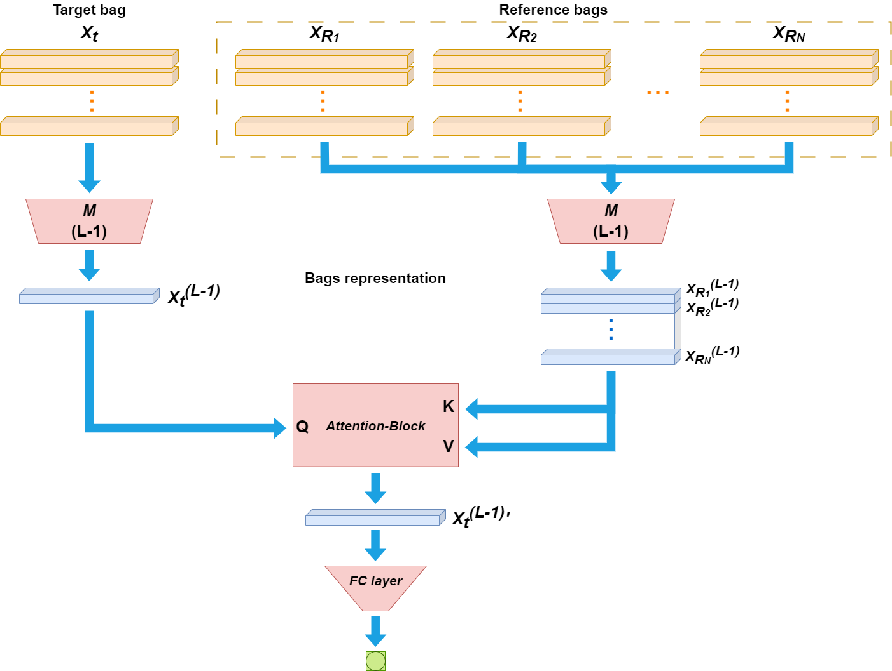

# Bag Attention Network (BAN)

<details>
<summary>
    <b>Multiple instance classification via neural networks. Enhancing bag similarity techniques via inter-bag attention</b>. 
</summary>

**Abstract:** The success of Multiple Instance Learning (MIL) has been confirmed by numerous studies and practical applications across various domains, including computer vision, biology, chemistry, medical diagnosis, and many others. Recently, leveraging deep neural networks to solve MIL problems has emerged as a successful approach. However, in most current multi-instance neural networks, the feature representation of each bag is learned individually, neglecting the relationships between bags. Therefore, this work introduces a novel neural network that emphasizes modeling the affinities between bags, capturing their similarity using attention mechanisms, thus achieving a richer and more effective bag representation compared to previous methods. The network, named Bag Attention Network (BAN), aims to outperform its pre-trained base model, used solely for bag embedding extraction. Experiments conducted on various MIL datasets demonstrate the performance comparison between the base model and BAN, showcasing the effectiveness of the latter.

</details>



## Installation

- Windows (Tested on Windows 11)
- CPU (Tested on CPU Intel Core i7 8th Gen)
- Python (3.7.16)

Please refer to the following instructions:

```bash
# create and activate the conda environment
conda create -n yourenvname python==3.7.16 -y
conda activate yourenvname
pip install -r requirements.txt
```

### Run

#### Run BAN on all datasets with all base models:
```python
run.bat #on Windows
run.sh #on Linux
```

#### Run BAN with base model:
```python
#base model = MI-Net (https://arxiv.org/abs/1610.02501)
python main_ban.py test_description --model=MI_net --dataset=musk1
python main_ban.py test_description --model=MI_net --dataset=musk2
python main_ban.py test_description --model=MI_net --dataset=elephant
python main_ban.py test_description --model=MI_net --dataset=fox
python main_ban.py test_description --model=MI_net --dataset=tiger
python main_ban.py test_description --model=MI_net --dataset=messidor

#base model = Attnet (https://arxiv.org/abs/1802.04712)
python main_ban.py test_description --model=attnet --dataset=musk1
python main_ban.py test_description --model=attnet --dataset=musk2
python main_ban.py test_description --model=attnet --dataset=elephant
python main_ban.py test_description --model=attnet --dataset=fox
python main_ban.py test_description --model=attnet --dataset=tiger
python main_ban.py test_description --model=attnet --dataset=messidor

#base model = SA-AbMILP (https://arxiv.org/abs/2005.12991)
python main_ban.py test_description --model=sa_abmilp --dataset=musk1
python main_ban.py test_description --model=sa_abmilp --dataset=musk2
python main_ban.py test_description --model=sa_abmilp --dataset=elephant
python main_ban.py test_description --model=sa_abmilp --dataset=fox
python main_ban.py test_description --model=sa_abmilp --dataset=tiger
python main_ban.py test_description --model=sa_abmilp --dataset=messidor
```

#### Run base model individually:
```python
#base model = MI-Net (https://arxiv.org/abs/1610.02501)
python main.py test_description --model=MI_net --dataset=musk1
python main.py test_description --model=MI_net --dataset=musk2
python main.py test_description --model=MI_net --dataset=elephant
python main.py test_description --model=MI_net --dataset=fox
python main.py test_description --model=MI_net --dataset=tiger
python main.py test_description --model=MI_net --dataset=messidor

#base model = Attnet (https://arxiv.org/abs/1802.04712)
python main.py test_description --model=attnet --dataset=musk1
python main.py test_description --model=attnet --dataset=musk2
python main.py test_description --model=attnet --dataset=elephant
python main.py test_description --model=attnet --dataset=fox
python main.py test_description --model=attnet --dataset=tiger
python main.py test_description --model=attnet --dataset=messidor

#base model = SA-AbMILP (https://arxiv.org/abs/2005.12991)
python main.py test_description --model=sa_abmilp --dataset=musk1
python main.py test_description --model=sa_abmilp --dataset=musk2
python main.py test_description --model=sa_abmilp --dataset=elephant
python main.py test_description --model=sa_abmilp --dataset=fox
python main.py test_description --model=sa_abmilp --dataset=tiger
python main.py test_description --model=sa_abmilp --dataset=messidor
```

##### Default values:
```python
--run=5
--folds=10
--epochs=50
--no-cuda=False
--config=utils/settings.yaml #where you can change hyperparameteres
--eval-per-epoch=0 #Choose 0 if you do not want to save the best model, otherwise choose the number of times per epoch you want to save the best model (based on test set)
```
